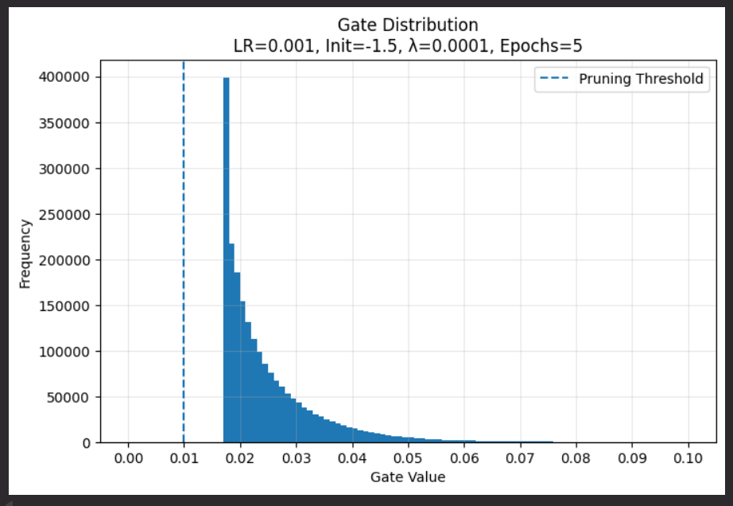
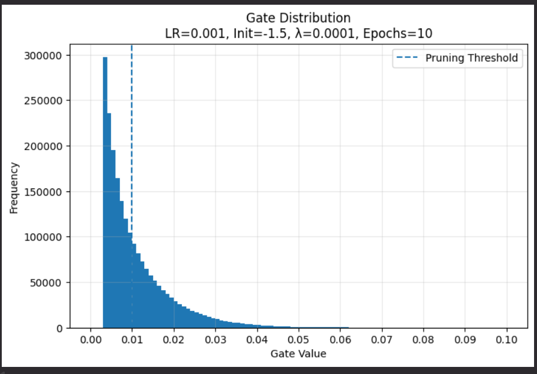
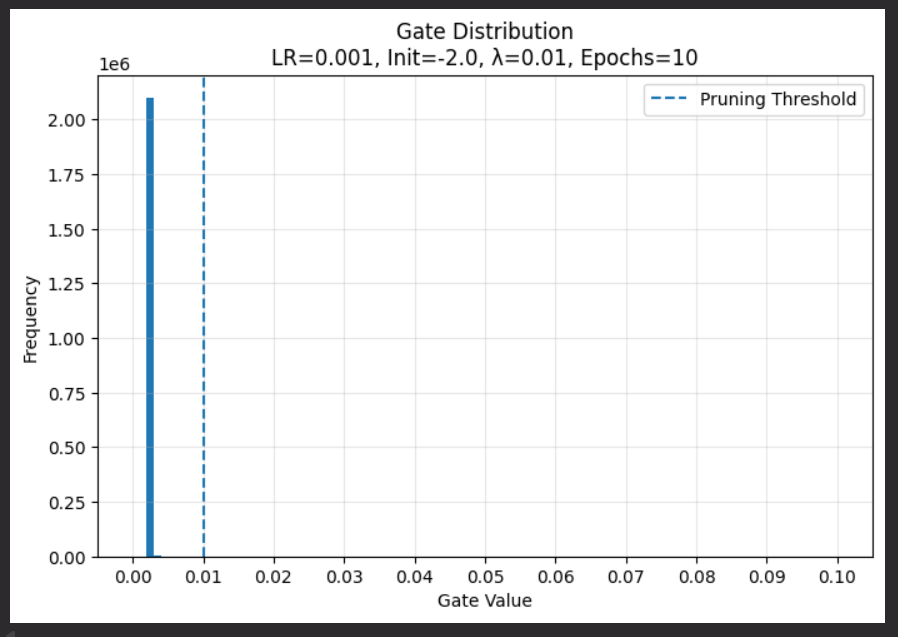

# Self-Pruning Neural Network for CIFAR-10 Classification

## Case Study Submission

This project implements a **Self-Pruning Neural Network** using learnable gate mechanisms for automatic weight pruning during training.  
The objective is to reduce unnecessary network connections while maintaining strong classification performance.

Instead of performing pruning after training, this approach allows the model to **learn which connections are important and which can be removed during training itself**.

The project was implemented using **PyTorch** on the **CIFAR-10 dataset** and focuses on the trade-off between:

- Model Accuracy
- Network Sparsity
- Pruning Strength (controlled using λ)

---

# Model Architecture

```text
Input Image (32 × 32 × 3)
        ↓
     Flatten
        ↓
PrunableLinear (3072 → 512)
        ↓
    BatchNorm
        ↓
       ReLU
        ↓
PrunableLinear (512 → 256)
        ↓
    BatchNorm
        ↓
       ReLU
        ↓
PrunableLinear (256 → 10)
        ↓
   Output Layer
```

---

# Core Idea

Each weight is controlled by a learnable gate.

Instead of directly using:

W

the network uses:

W' = W · σ(S)

Where:

- W = original weight
- S = learnable gate score
- σ(S) = sigmoid gate value between 0 and 1
- W' = effective pruned weight

Interpretation:

- Gate near 1 → important connection → keep
- Gate near 0 → weak connection → prune

---

# Why L1 Regularization?

To encourage pruning, sparsity loss is added.

## Total Loss Function

L = L_cls + λ ∑g

Where:

- L_cls = classification loss (CrossEntropyLoss)
- λ = sparsity control parameter
- ∑g = total gate activation values

L1 regularization pushes gate values toward zero, helping the model automatically remove unnecessary connections.

Example:

σ(-2) ≈ 0.12

This is why negative gate initialization (-1.5 or -2.0) improves pruning behavior.

---

# Dataset Used

## CIFAR-10

- 60,000 color images
- 10 classes
- Image size: 32 × 32 × 3

Split:

- Training: 50,000
- Testing: 10,000

---

# Experimental Setup

Tested Parameters:

## Learning Rate

0.001

## Gate Initialization

- -1.5
- -2.0

## Lambda Values

- 0.0001
- 0.001
- 0.01

## Epochs

- 5
- 10

Pruning threshold:

gate < 0.01

Any gate below this threshold is considered pruned.

---

# Updated Experimental Results

## Least Aggressive Case

### Configuration

- Learning Rate = 0.001
- Gate Init = -1.5
- Lambda = 0.0001
- Epochs = 5

### Performance

- Accuracy = **74.19%**
- Sparsity = **0.00%**



### Observation

This configuration prioritizes accuracy with almost no pruning.  
It represents the weakest pruning behavior and acts as the baseline model.

---

## Optimal Balanced Case

### Configuration

- Learning Rate = 0.001
- Gate Init = -1.5
- Lambda = 0.0001
- Epochs = 10

### Performance

- Accuracy = **74.61%**
- Sparsity = **59.75%**



### Observation

This produced the best practical trade-off between accuracy and pruning.

The model improved accuracy while removing more than half of unnecessary connections, making it the best balanced configuration.

---

## Most Aggressive Case

### Configuration

- Learning Rate = 0.001
- Gate Init = -2.0
- Lambda = 0.01
- Epochs = 10

### Performance

- Accuracy = **71.57%**
- Sparsity = **99.96%**



### Observation

This produced the highest pruning level.

Nearly the entire network was pruned while still preserving usable classification performance, proving strong over-parameterization in the original network.

---

# Additional Strong Aggressive Case

### Configuration

- Learning Rate = 0.001
- Gate Init = -2.0
- Lambda = 0.001
- Epochs = 10

### Performance

- Accuracy = **74.01%**
- Sparsity = **99.71%**

### Observation

This is often the best “practical aggressive” model because it maintains very high accuracy while still achieving extreme sparsity.

---

# Key Findings

## 1. More Epochs = More Pruning

5 epochs often produced near-zero sparsity.

10 epochs allowed gates to move below threshold and produced strong pruning.

---

## 2. Higher λ = Stronger Sparsity

As λ increased:

- sparsity increased
- accuracy slightly decreased

This confirms correct pruning behavior.

---

## 3. Gate Initialization Matters

More negative initialization improved pruning significantly.

Gate Init = -2.0 consistently produced stronger sparsity than -1.5.

---

## 4. Accuracy Was Preserved

Even after extreme pruning (>99%), the model maintained strong accuracy.

This proves many original connections were redundant.

---

# Conclusion

This project successfully implemented a **Self-Pruning Neural Network** using learnable gates and L1 regularization.

The model was able to:

- identify unnecessary connections
- prune them automatically during training
- maintain strong classification performance
- significantly reduce model complexity

### Final Best Balanced Result

- **74.61% Accuracy**
- **59.75% Sparsity**

### Final Highest Sparsity Result

- **99.96% Sparsity**
- with usable classification performance

This confirms that self-pruning is an effective strategy for building efficient neural networks without major performance loss.

---

# Technologies Used

- Python
- PyTorch
- NumPy
- Matplotlib
- Kaggle Notebook
- CIFAR-10 Dataset
