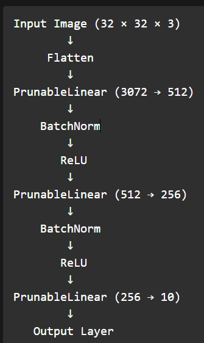
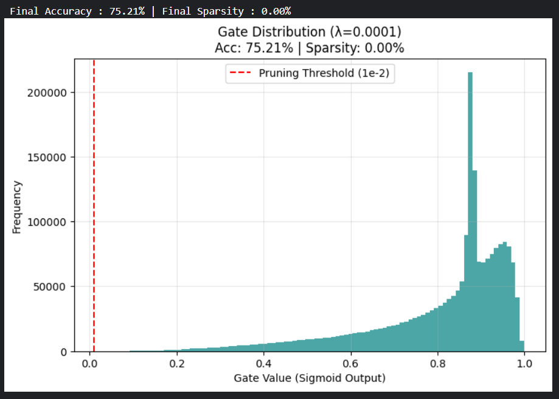
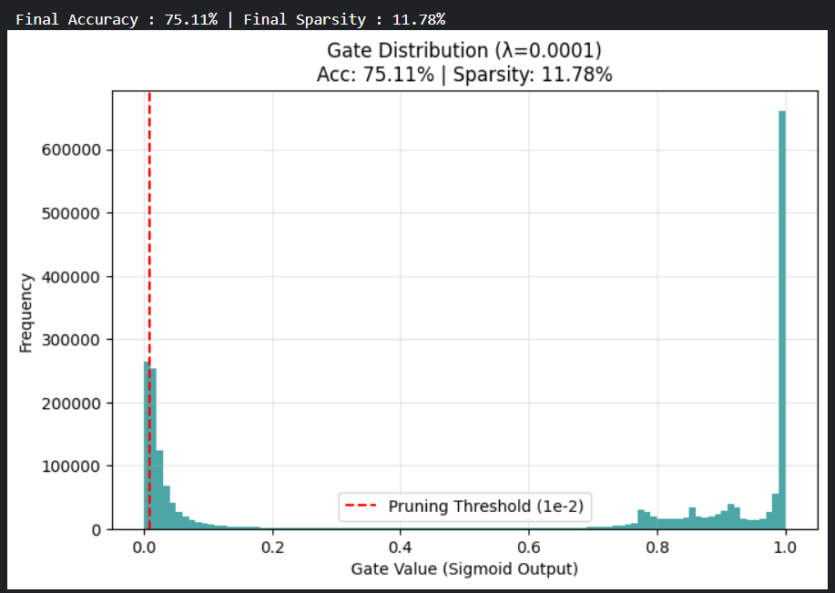
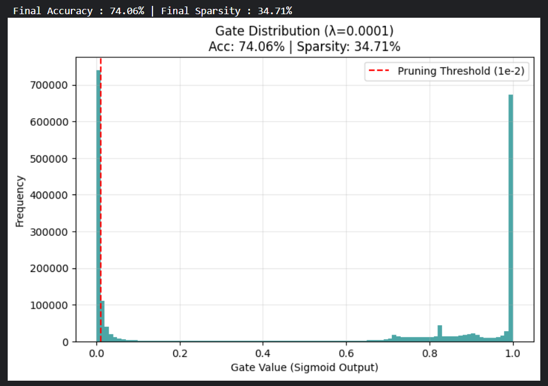
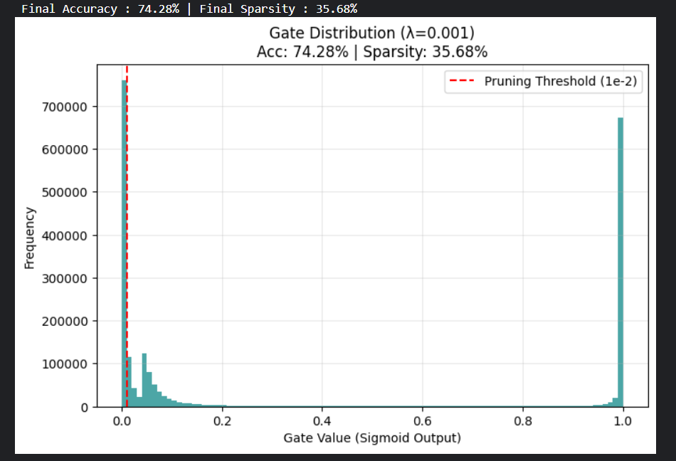
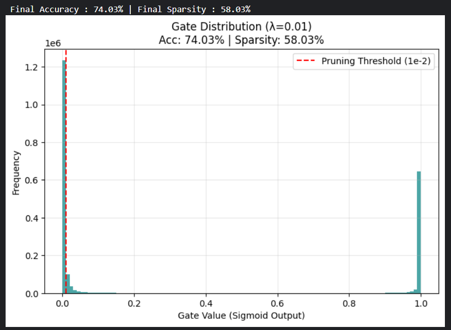
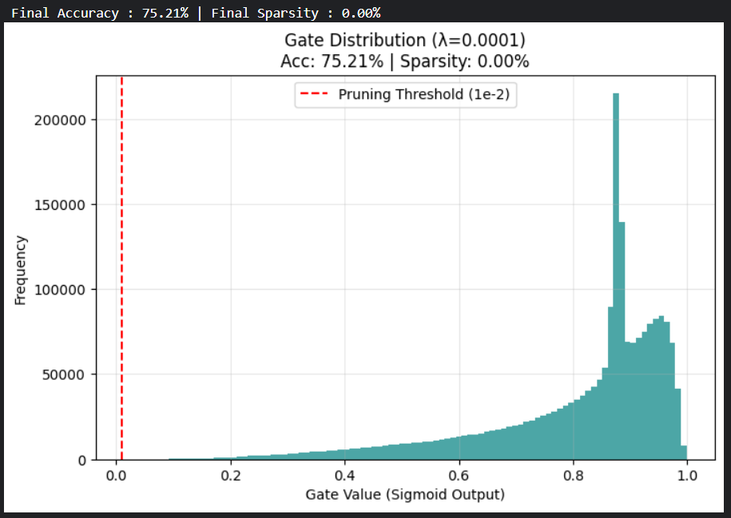

# Self-Pruning Neural Network for CIFAR-10 Classification

## Case Study Submission

This project implements a **Self-Pruning Neural Network** using learnable gate mechanisms for automatic weight pruning during training.
The goal is to reduce unnecessary network connections while maintaining strong classification performance.

Unlike traditional pruning methods that remove weights after training, this approach allows the model to **learn which connections are useful and which should be removed during training itself**.

The project was implemented using **PyTorch** on the **CIFAR-10 dataset** and focuses on the trade-off between:

- Model Accuracy
- Network Sparsity
- Pruning Strength (controlled using λ)
- Gate Learning Rate impact on pruning behavior

---

# Model Architecture

```text
Input Image (32 × 32 × 3)
        ↓
     Flatten
        ↓
PrunableLinear (3072 → 512)
        ↓
    BatchNorm
        ↓
       ReLU
        ↓
PrunableLinear (512 → 256)
        ↓
    BatchNorm
        ↓
       ReLU
        ↓
PrunableLinear (256 → 10)
        ↓
   Output Layer
```

---

# Core Idea

Each weight is controlled by a learnable gate.

Instead of directly using:

W

The network uses:

**W' = W · σ(S)**

Where:

- W = original weight
- S = learnable gate score
- σ(S) = sigmoid gate value between 0 and 1
- W' = effective pruned weight

Interpretation:

- Gate near 1 → important connection → keep
- Gate near 0 → weak connection → prune

---

# Why L1 Regularization?

To encourage pruning, sparsity loss is added.

## Total Loss Function

**L = Lcls + λ ∑g**

Where:

- Lcls = classification loss (CrossEntropyLoss)
- λ = sparsity control parameter
- ∑g = total gate activation values

L1 regularization pushes gate values toward zero, helping the model automatically remove unnecessary connections.

This improves pruning performance without requiring manual post-training pruning.

---

# Dataset Used

## CIFAR-10

- 60,000 color images
- 10 classes
- Image size: 32 × 32 × 3

Split:

- Training: 50,000
- Testing: 10,000

### Sample Dataset Visualization


---

# Experimental Setup

Tested Parameters:

## Learning Rate

- 0.001

## Gate Learning Rate

- 0.1
- 0.01
- 0.001

## Gate Initialization

- 2.0

## Lambda Values

- 0.0001
- 0.001
- 0.01

## Epochs

- 5
- 10

Pruning threshold:

**gate < 0.01**

Any gate below this threshold is considered pruned.

---

# Network Visualization

### Model Architecture Summary



---

# Experimental Results

## Best Balanced Pruning Case

### Configuration

- Learning Rate = 0.001
- Gate LR = 0.1
- Gate Init = 2.0
- Lambda = 0.01
- Epochs = 10

### Performance

- Accuracy = **74.03%**
- Sparsity = **58.03%**

### Observation

This produced the best balance between accuracy and pruning.
The model retained strong performance while removing more than half of the network connections.

---

## Highest Accuracy Case

### Configuration

- Learning Rate = 0.001
- Gate LR = 0.01
- Gate Init = 2.0
- Lambda = 0.0001
- Epochs = 10

### Performance

- Accuracy = **75.21%**
- Sparsity = **0.00%**



### Observation

This configuration prioritized prediction performance over pruning.
It achieved the highest accuracy but almost no sparsity.

---

## Strong Early Pruning Case

### Configuration

- Learning Rate = 0.001
- Gate LR = 0.1
- Gate Init = 2.0
- Lambda = 0.0001
- Epochs = 5

### Performance

- Accuracy = **75.11%**
- Sparsity = **11.78%**



### Observation

Even with fewer epochs, the model began pruning effectively when gate learning rate was high.
This shows the importance of gate learning dynamics.

---

# Accuracy vs Sparsity Trade-Off




### Observation

As λ increases:

- sparsity increases
- accuracy slightly decreases

This confirms correct pruning behavior and demonstrates the trade-off between compactness and performance.

---

# Key Findings

## 1. Gate Learning Rate Matters Most

Higher gate learning rate (**0.1**) produced meaningful pruning.
Lower gate learning rates (**0.01 and 0.001**) resulted in near-zero sparsity.

---

## 2. More Epochs = More Pruning

5 epochs produced lower sparsity.
10 epochs allowed gates to move below threshold and increased pruning significantly.

---

## 3. Higher λ = Stronger Sparsity

As λ increased:

- sparsity increased
- accuracy slightly decreased

This confirms effective regularization behavior.

---

## 4. Accuracy Was Preserved

Even with significant pruning, the model maintained strong classification accuracy around 74–75%.

This proves many original network connections were redundant.

---

# Conclusion

This project successfully implemented a **Self-Pruning Neural Network** using learnable gates and L1 regularization.

The model was able to:

- identify unnecessary connections
- prune them automatically during training
- maintain strong classification performance
- reduce model complexity without major accuracy loss

## Final Best Practical Result

- **74.03% Accuracy**
- **58.03% Sparsity**



This represents the strongest real trade-off between compression and performance.

## Final Highest Accuracy Result

- **75.21% Accuracy**
- Minimal pruning



This confirms that stronger pruning requires careful tuning of gate learning rate and λ.

Overall, self-pruning is an effective strategy for building efficient neural networks without significant performance degradation.

---

# Technologies Used

- Python
- PyTorch
- NumPy
- Matplotlib
- Kaggle Notebook
- CIFAR-10 Dataset
